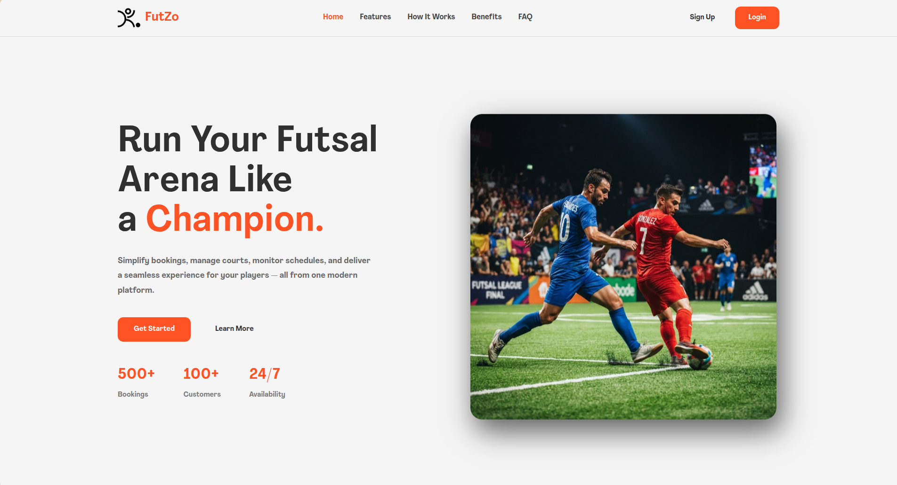
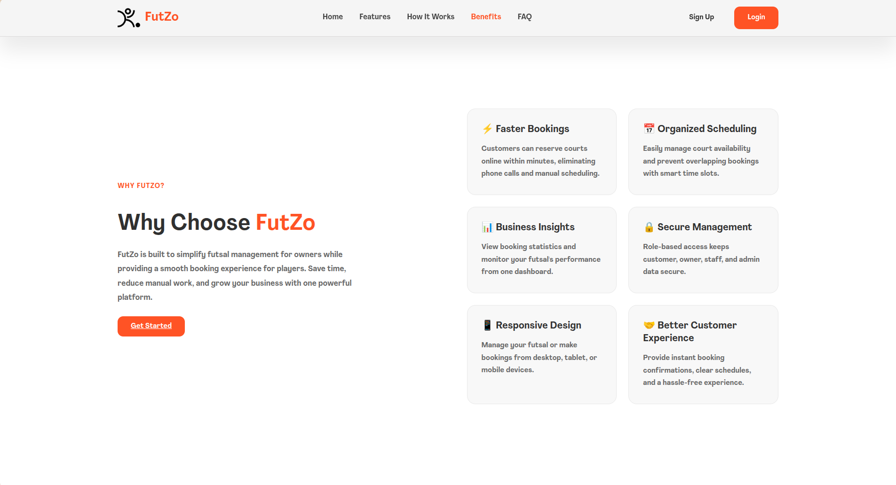
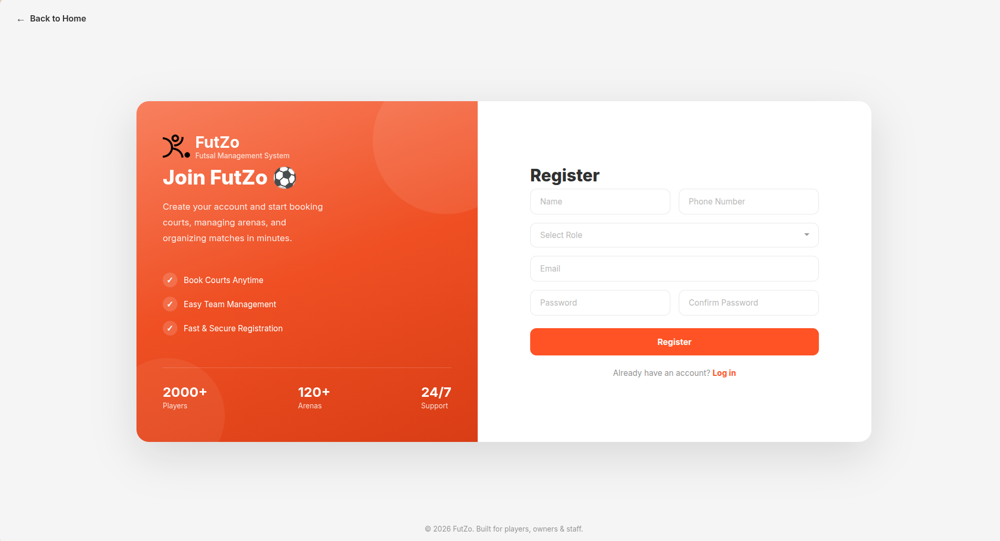

# ⚽ FutZo - Futsal Management System

A web-based **Futsal Management System** developed using **PHP, MySQL, HTML, CSS, and JavaScript**. The system simplifies futsal booking and management by providing dedicated dashboards for **Customers**, **Owners**, and **Administrators**.

---

## 📖 Overview

FutZo is designed to streamline the process of booking futsal courts while allowing futsal owners to manage their facilities and administrators to monitor the entire platform.

The project was developed as an academic project with the goal of providing a complete online futsal booking solution.

---

## ✨ Features

### 👤 Customer

- Register and Login
- Browse available futsals
- View futsal details
- Book available time slots
- View booking history
- Cancel bookings
- Manage profile

### 🏟️ Owner

- Register futsal
- Edit futsal information
- Manage facilities
- Manage available time slots
- View customer bookings
- Confirm or reject bookings
- View dashboard statistics

### 🛡️ Admin

- Dashboard overview
- Approve or reject futsal registrations
- Manage users
- Manage futsals
- Monitor bookings

---

## 🛠️ Technologies Used

- PHP
- MySQL
- HTML5
- CSS3
- JavaScript
- XAMPP / Apache
- Git & GitHub

---

## 📂 Project Structure

```
futsal-management-system/
│
├── admin/
├── customer/
├── owner/
├── assets/
│   ├── css/
│   ├── images/
│   ├── uploads/
│   └── icons/
│
├── config/
├── database/
├── includes/
└── README.md
```

---

## ⚙️ Installation

### 1. Clone the repository

```bash
git clone https://github.com/prashanna-png/futsal-management-system.git
```

### 2. Move the project

Copy the project folder into your web server directory.

Example (XAMPP):

```
htdocs/futsal-management-system
```

### 3. Create the database

Open **phpMyAdmin**

Create a database named:

```
futsal_management_system
```

### 4. Import the SQL file

Import the provided SQL database into the newly created database.

### 5. Configure database connection

Open

```
config/db.php
```

Update the database credentials if necessary.

Example:

```php
$host = "localhost";
$user = "root";
$password = "";
$database = "futsal_management_system";
```

### 6. Start Apache and MySQL

Launch your local server.

### 7. Open the project

```
http://localhost/futsal-management-system
```

---

## 📷 Screenshots



---

## 📌 Future Improvements

- Online payment integration
- Email notifications
- QR Code booking verification
- Booking calendar
- Google Maps integration
- Mobile responsive redesign
- Rating & review system
- Live slot availability

---

## 👨‍💻 Developer

**Prashan**

GitHub:
https://github.com/prashanna-png

---

## 📄 License

This project was developed for educational purposes.

```

## I also recommend adding:

- `LICENSE`
- `.gitignore`
- `database/futsal_management_system.sql`

to your repository. It will make your GitHub project look much more professional and easier for others to run.
```
